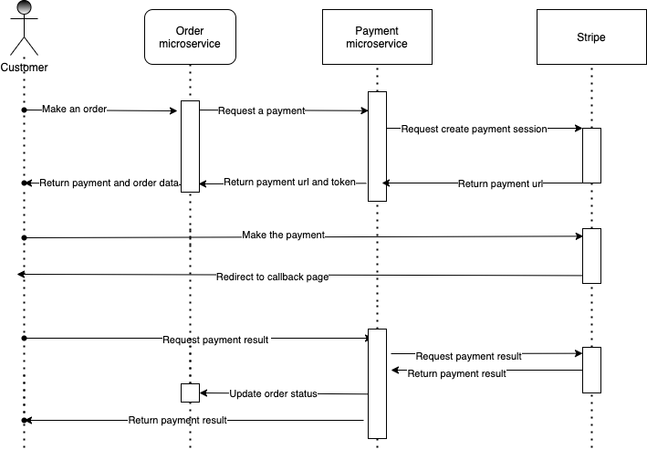

# Payment service

[stripe](https://stripe.com/en-ca) implementation


## Start the project

1. Create a payment database
2. Config env and docker compose
3. Run ./run.sh
4. Run migrate.py

## Domain

[http://127.0.0.1:5001/api/v1/payment](http://127.0.0.1:5001/api/v1/payment)

## File structure

- app.py (app)
- routes.py (All routes)
- clients/ (Http clients)
- services/ (Business logic layer)
- models/ (Data models)
- common/ (Util classes)
- resources/ (Controllers deal with requests)

## Flow



## Methods

prefix: /api/v1
- GET: /payment?token={{token}} 
    - Response:
        ``` json
        {
            "order_id": "",
            "payment_url": "",
            "status": "open", // Enum open, expired, complete
            "payment": {
                "amount":50000,
                "method":"card", // payment method, e.g. card, alipay
                "status": "paid", // Enum paid, unpaid
                "currency":"sgd" 
            },
            "expires_at":1647839607 // Time stamp

            
        }
        ```
- POST: /payment
    - Parameters:
        ``` json
        {
            "orderId":"",
            "currency":"sgd",
            "amount":50000, //cents
            "callbackUrl":"" // after success/failure redirect to this
        }
        ```
    - Response:
        ``` json
        {
            "order_id": "",
            "payment_url": "",
            "expires_at": 1647839607,
            "token": "", // Unique id to access payment data
            "status": "open"
        }
        ```


